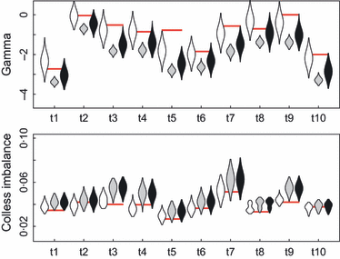
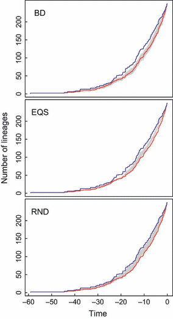
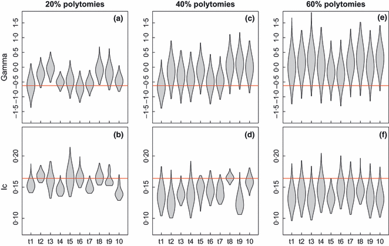

# A simple polytomy resolver for dated phylogenies

## Information
- Title: A simple polytomy resolver for dated phylogenies
- Authors : Tyler S. Kuhn, Arne Ø. Mooers and Gavin H. Thomas
- Year : 2011
- doi : https://doi.org/10.1111/j.2041-210X.2011.00103.x

## Importants
- Model based polytomy resolving method has not been proposed.
- Present suitable for previously published trees by modelling diversification at polytomies in dated phylogenetic trees.
- Compared w/ LnN, EQS, RND, RND2 models
- Tested to cetacean and mammal supertree (5020 terminal taxa, >2500 unresolved nodes) [^(Fritz(2009))]
- BD approach is may be used for testing whether alternate diversification model better fit the data.

## To Read
- [^(Purvis(1995))]
- [^(Bininda(2007))]
- [^(Fritz(2009))]
- [^(Webb(2008))]
- [^(Day(2008))]
- [^(Steeman(2009))] : Compared the fit of models describing the diversification of cetaceans
  - Pure birth; const BD; linear diversity dependence; exponential diversity dependence; 3 rate shift models
  
## Abstract

> 1. Unresolved nodes in phylogenetic trees (polytomies) have long been recognized for their influences on specific phylogenetic metrics such as topological imbalance measures, diversification rate analysis and measures of phylogenetic diversity. However, no rigorously tested, biologically appropriate method has been proposed for overcoming the effects of this phylogenetic uncertainty.
> 2. Here, we present a simple approach to polytomy resolution, using biologically relevant models of diversification. Using the powerful and highly customizable phylogenetic inference and analysis software `BEAST` and `R`, we present a semi-automated 'polytomy resolver' capable of providing a distribution of tree topologies and branch lengths under specified biological models.
> 3. Utilizing both simulated and empirical data sets, we explore the effects and data sets, we explore the effects and characteristics of this approach on two widely used phylogenetic tree statistics, Pybus' gamma ($\gamma$) and Colless' normalized tree imbalance ($I_{c}$). Using simulated pure birth trees, we find no evidence of bias in either estimate using our resolver. Applying our approach to a recently published Cetacean phylogeny, we observed the expected small positive bias in $\gamma$ and ecrease in $I_{c}$.
> 4. We further test the effect of polytomy resolution on diversification rate analysis using the Cetacean phylogeny. We demonstrate that using a birth-death model to resolve the Cetacean tree with 20%, 40% and 60% of random nodes collapsed to polytomies gave qualitatively similar patterns regarding the tempo and mode of diversification as the same analyses on the original, fully resolved phylogeny.
> 5. Finally, we applied the birth-death polytomy resolution to large (>5000 tips), but unresolved, supertree of extant mammals. We report a distribution of fully resolved model-based trees, which should be useful for many future analysis of the mammalian supertree.

## Introduction

- polytomy = multifurcation rather than bifurcation. 
  - Soft polytomy = incomplete taxonomic resolution ([^(Maddison(1989))], [^(Desalle(1994))])
  - Hard polytomy = multiple simultaneous splitting events ([^(Hoelzer(1994a))], [^(Hoelzer(1994b))])
- Some phylogenetic methods adapted to allow for polytomies ([^(BiSSE(2007))]), but most methods require complete, bifurcating trees. ([^(FitzJohn(2009))], `LASER` in [^(Rabosky(2006))], `EDGE` of Existence program in [^(Isaac(2007))])
- Problem : When missing tips are added to phylogenies based on taxonomic information, as is frequently the practice when constructing clade-wide supertrees (Angiosperms in [^(Davies(2004))], Ruminants in [^(Hernandez(2005))], Primates in ([^(Ranwez(2007))]))
  - These methods are formed with no age estimates, and additional polytomies are created.

> [!Note]
> Angiosperm = 속씨식물 \
> Ruminant = 반추동물 \
> Primate = 영장류

[^(Maddison(1989))]: Maddison, W; Reconstructing character evolution on polytomous cladograms; 1989;
[^(Desalle(1994))]: Desalle, R., Absher, R., Amato, G.; Speciation and phylogenetic resolution; 1994;
[^(Hoelzer(1994a))]: Hoelzer, G., Meinick, D.; Patterns of speciation and limits to phylogenetic resolution; 1994;
[^(Hoelzer(1994b))]: Hoelzer, G., Meinick, D.; Reply from G.A. Hoelzer and D.J. Melnick; 1994;
[^(BiSSE(2007))]: 
[^(FitzJohn(2009))]: FitzJohn, R., Maddison, W., Otto, S.; Estimating trait-dependent speciation and extinction rates from incompletely resolved phylogenies; 2009;
[^(Rabosky(2006))]: Rabosky, D.; LASER: A maximum likelihood toolkit for detecting temporal shifts in diversification rates from molecular phylogenies; 2006;
[^(Isaac(2007))]: Issac, N.J.B., Turvey, S.T., Collen, B., Waterman, C., Baillie, J.E.M.; Mammals on the EDGE: conservation priorities based on threat and phylogeny; 2007;
[^(Davies(2004))]: Davies, T.J., Barraclough, T.G., M.W., Soltis, P.S., Soltis, D.E., Savolainen, V.; Darwin's abominable mystery: insights from a supertree of the angiosperms; 2004;
[^(Hernandez(2005))]: Hernandez, F.M., Vrba, E.S.; A complete estimate of the phylogenetic relationships in Ruminantia: a dated species-level supertree of the extant ruminants; 2005;
[^(Ranwez(2007))]: Ranwez, V., Berry, V., Criscuolo, A., Fabre, P.H., Guilemot, S., Scornavacca, C., Douzery, E.J.P.; PhySIC: a veto supertree method with desirable properties; 2007;

- Two general approach (Both implemented within a Bayesian framework)
    1. Addition of missing taxa as empty sequences at the tree inference stage where the placement of missing species can be constrained using priors on topology.
       - Topology priors might be derived from published phylogenies or taxonomic information.
       - Can use Bayesian phylogenetic tools (e.g. relaxed molecular clocks, molecular evolutionary parameters, tree priors)
       - However, many published supertrees can't be dealth with this manner.
- We present a simple approach suitable for application to previously published trees (particularly supertrees) by modelling diversification at polytomies in dated phylogenetic trees.
  - At present, there is no widely accepted model-based method of dealing with soft polytomies.
- Current methods involve 
  1. Random resolution of tree topology 
     1. w/o specifying branch lengths
     2. w/ branch lengths drawn from a specific distribution
  2. Allow analyses to work around effects of polytomies rather than explicitly attempt to resolve them.
- We do not topology-only approach because many use of phylogenies require branch length.
  
- Branch length assigning methods
  - LnN ([^(Purvis(1995))], [^(Bininda(2007))], [^(Fritz(2009))])
    - unknown node ages $\propto$ $\log$ parent clade
  - EQS ([^(Webb(2008))])
    - branch lengths distributed evenly b/w known parent and daughter age
  - RND/RND2 ([^(Day(2008))])
    - randomly assigned to paths created during polytomy resolution

[^(Purvis(1995))]: Purvis, A.; A composite estimate of primate phylogeny; 1995;
[^(Bininda(2007))]: Bininda-Emonds, O.R.P., Cardillo, M., Jones, K.E., MacPhee, R., Beck, R.M.D., Grenyer, R., Price, S.A., Vos, R.A., Gittleman, J.L., Purvis, A.; The delayed rise of present-day mammals; 1982;
[^(Fritz(2009))]: Fritz, S.A., Bininda-Emonds, O.R.P., Purvis, A.; Geographical variation in predictors of mammalian extinction risk: big is bad, but only in the tropics; 2009;
[^(Webb(2008))]: Webb, C.O., Ackerly, D.D., Kembel, S.W.; Phylocom: software for the analysis of phylogenetic community structure and trait evolution; 2008;
[^(Day(2008))]: Day, J.J., Cotton, J.A., Barraclough, T.G.; Tempo and mode of diversification of Lake Tanganyika Cichlid Fishes; 2008;

- We present alternative approach: const. rate birth-death model to sample from topologies and branch length distributions. (BD approach)
  - Used `BEAST`.

## Resolving polytomies with a birth-death model

- Used `BEAST`. [^(Drummond(2007))]
  - Bayesian approach
  - Priors (e.g. branch rate, tree topology) can be placed on.
    - Allow sampling from the prior only + Application of prior constraint to tree topology and branch lengths
- Script
  - Used `APE` ([^(Paradis(2004))]) in `R`
    - User input tree remain fixed
    - Polytomies free to be permuted
  - Script 1
    - Write complete `XML` input file w/ topology constraints + `BEAST` commands + birth-death tree prior
  - Script 2
    - Define topology constraint only directly editting `XML` or `BEAUTI` ([^(Drummond(2007))])
  - `BEAST` MCMC
    - estimate parameters of BD model ($\lambda - \mu$, $\frac{\mu}{\lambda}$)

[^(Drummond(2007))]:
[^(Paradis(2004))]:

## Testing the approach

### Proof of concept

- resolved single 10-tip polytomy to ensure the estimated model parameters ($\mu$, $\lambda$)
- Preliminary analyses
  - sample trees every 1000 iterations with 10% burnin to yield posterior distributions of 10000 trees.
  - For all `BEAST` output, they assessed mixing, convergence and 10% burnin was appropriate by visual inspection of 3 statistics in `TRACER` v1.5. ([^(Rambaut(2009))])
    - net diversification rate ($\lambda - \mu$)
    - relative extinction rate ($\frac{\mu}{\lambda}$)
    - root age
- Considered these 3 statistics to be the most relevant for determining whether tree space has been adequately sampled.
  - because they refer directly to the tree sampling prior or tree structure itself.
- With `BEAST`, a particular node age will be changed in 50% of the possible move types affecting that node. ([^(Drummond(2002))])
  - So, a tracer of the node's age represents a conservative estimate of the number of changes.
  - Therefore, used the 'root node' as a standard marker for all the other nodes.
- From post-burnin estimated sample size (ESS) value > 200 as evidence that stationarity has been reached.

[^(Rambaut(2009))]:
[^(Drummond(2002))]:

### Comparison among resolution methods

- Comparison of previous methods (Non-model based methods: LnN, EQS, RND, RND2)
  - Usually two step in estimation
    1. Non-model-based approach
    2. Branch length inference (Differs by methods)
       - LnN [^(Purvis(1995))] : determine unknown node ages based on the theoretical relationship b/w clade size & node age distribution under pure birth process or birth-death process. ([^(Grafen(1989))], [^(Nee(1995))])
         - $T_{D} = T_{A}\frac{\log{(N_{D})}}{\log{(N_{A})}}$
           - $T_{D}$: age of the daughter node
           - $N_{D}$: size of the daughter node
           - $N_{A}$: size of the ancestral node
           - $T_{A}$: age of the ancestral node
         - Issue : Negative branch length 
       - EQS
         - total path length b/w polytomy and constrained daughter node split equally.
         - assign the length of each branch ($l_{b}$) using $l_{b} = \frac{1}{n}l_{T}$
           - $n$ = # edges
           - $l_{T}$ = total path length b/w polytomy and the constrained daughter node
       - RND
         - the toal path length from polytomy to constrained daughter node split into $n$ sections of random length, where sum of all $n$ random sections must equal to the total path
           - To escape negative branch length issue, must estimate path length of the shortest polytomy to constrained daughter node path first.
       - RND2
         - Estimate edge lengths sequentially through the tree
           - Begin with first node up from the root, follow that path to the tip before returning to the next node to tip path.
         - At each edge, random # from unif(0,1) $\rarr$ proportion of the remaining path length assigned to the current edge.
- Tested the behaviors and inherent bias of these 4 models
  - Compared the summary tree statistic, Pybus' gamma ($\gamma$, `TREESTAT` v1.2).
  - Result: Fig1
    - RND method is most similar with BD method, but showed evidence of size-depandent bias in $\gamma$.
    - This is problematic for application of RND approach to very large supertrees with $N \gg 1000$.

[^(Grafen(1989))]:
[^(Nee(1995))]:

### Simulated birth-death trees

- tested with two sets of 10 trees, one w/ 64 tips and one w/ 250 tips.
- randomly selected and collapsed 40% of the nodes back to polytomies
- Tested w/ BD model using $\lambda = 0.1$ and $\mu = 0.0$ by `GEIGER` in `R`.
- Behavior of approaches
  - Fig 2: recovered pseudo-posterior distribution of tree statistics
    - BD was the only that recovered reliable $\gamma$ and $I_{C}$.
    - </img>
  - Fig 3: plots of lineages through time for one of the 10 (250-tip trees) comparing w/ original tree.
    - EQS and RND methods produce noticeable shift.
    - </img>
  - EQS and RND approaches do not bias the diversification rate to any particular prior model.
  - EQS and RND approaches introduce size-dependent biases in both $\gamma$ and $I_{C}$.
  - RND approach is inconsistent in observed bias.
- Therefore, BD is the most consistent methods resolving polytomy.
- For each BD rate ($\lambda$ = 0.1, 0.2, 0.3 and $\mu$ = 0, 0.05, 0.09, 0.15, 0.25) by simulating multiple 64-tip 10 tree data, 20%, 40% 60% node randomly collapse to polytomies each. 
  - Both values does not appear to change substantially.

### Empirical test - cetacean radiation

- Obtained fully resolved cetacen phylogeny (by Rabosky)
- produced 3 sets of 10 randomly polytomized (20%, 40% 60%)
- resolved for each tree by BD approach.
- compared $\lambda - \mu$ in original tree and mean of each polytomized tree $\rarr$ similar
- compared $\frac{\mu}{\lambda}$ in original tree and median. $\rarr$ increased w/ size of polytomy.
- $\gamma$ and $I_{C}$: fig 5
  - </img>
- Reanalysed polytony distribution using `LASER` [^(Rabosky(2006))], described in [^(Steeman(2009))]
  - As polytomy increased (decreased topology resolution), the number of times that const. rate model can't be rejected increased.
  - Const rate BD models does not mask strong patterns in data, even w/ a high proportion of polytomies.
  - Note that parameter estimates for both background and elevated diversification rates for the original tree fall within 95% sampling intervals of polytomy resolved trees
    - Caution that it is not appropriate to use results from the BD approach to determine whether diversification of a particular phylogeny follows a const. rates model.
    - BD approach is may be used for testing whether alternate diversification model better fit the data.

[^(Steeman(2009))]:

### Mammalian supertree

- Mammalian supertree ([^(Bininda(2007))], [^(Fritz(2009))])
- Only 50% is resolved.

## Conclusion

- Allow inference based on biologically relevant model-based simulation of branch lengths for all nodes within a polytomous tree, without modification and with minimal violation of assumptions.
- BD approach generally recover the expected starting values for diversification (mean growth rate, relative death rate, Pybus' $\gamma$, Colless' tree imbalance)
- BD approach showed no size dependency.
- Some bias are predicted and known, but the approach can resolve within models.
- Still, polytomy resolved trees return slightly higher values of $\gamma$ than $I_{C}$.
- BD model can be extended to rate heterogeneous BD models.